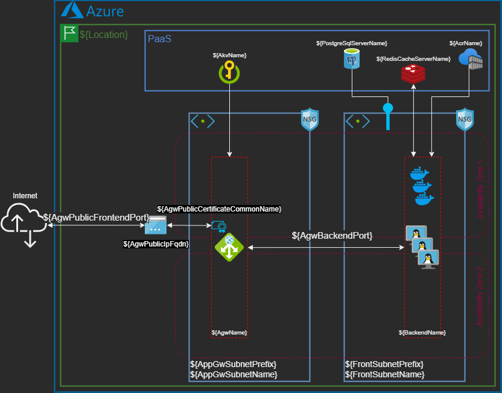
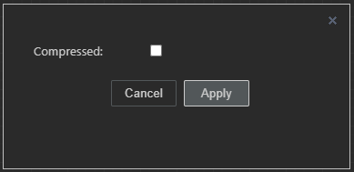
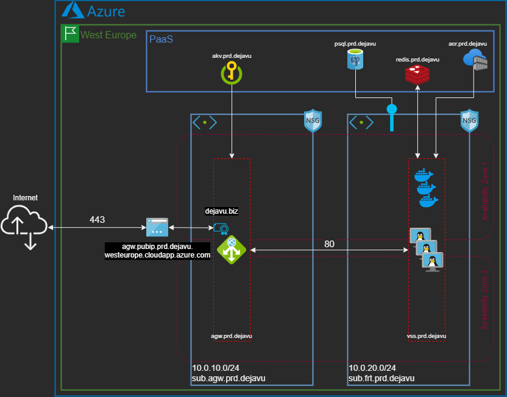

# **Let Terraform write your docs!**

> :calendar: December 2022 - [Damien Carpy](https://github.com/DamienCarpy) - #[Terraform](https://github.com/search?q=terraform) #[IaC](https://github.com/search?q=iac) #[DocsAsCode](https://github.com/search?q=docsascode)

<p align="center">
    
</p>

`TAD`, `HLD`, `LLD`, `technical diagram`, `readme`: these types of **deliverables** are **essential** to describe our IT projects, but over time they become a real **headache** to **update**. They might even seem far away from the tools reserved for computer code. But what if it was possible to make these deliverables dynamic, at the same pace as code? This is indeed the case, thanks to the [docs-as-code](https://www.writethedocs.org/guide/docs-as-code/) philosophy, and the use of [Terraform](https://www.terraform.io/) and [terraform-docs](https://terraform-docs.io/).

The **benefits** are **immediate**:
* **Time saving** thanks to the concepts of **reuse** and **automation**,
* **Durability** of a documentation that updates **automatically** along with the code,
* Guarantee of **accurate documentation** that follows the **evolution** of the project.

## **Docs-as-code to the rescue!**
In the mid-2010s, [Riona MacNamara](https://www.usenix.org/conference/srecon16europe/program/presentation/macnamara) shared the observation with her colleagues of the poor general level of project documentation at Google. They decided to improve it and launched the "g3doc" project.

Since this impulse and the conferences that followed, several developers and computer scientists have subsequently documented this approach on a community site "[Write the Docs](https://www.writethedocs.org/)", where they define [Documentation as Code](https://www.writethedocs.org/guide/docs-as-code/) as follows:

> ### <p align="center"><font size="10">“</font>You should be writing documentation with the same tools as code.<font size="10">“</font></p>

This philosophy includes using the [Markdown](https://en.wikipedia.org/wiki/Markdown) syntax, versioning docs with [Git](https://en.wikipedia.org/wiki/Git), etc.

Just for fun, I’d add we could even rename it "**e-Docs-as-Code**", just to make it a [palindrome](https://en.wikipedia.org/wiki/Palindrome) 😉

## **Errors & drifts**
Let's go back for a moment to the nature of the documents that interest us. An architecture document, whether it is a Technical Architecture Document (TAD), a [High-Level Design](https://en.wikipedia.org/wiki/High-level_design) (HLD), a [Low-Level Design](https://en.wikipedia.org/wiki/Low-level_design) (LLD), a technical diagram or a code descriptor (readme), is made up of **static information** (technical, functional) which is therefore recorded **manually**.

As a result, there is a high probability for the documentation to be wrong, for two key reasons:
1. Manual processing means **human error**: **information can be incomplete** or **even incorrect**, sometimes due to discrepancies with the actual implementation.
2. Over time, the **documentation will inexorably drift**... even if it was properly written at the beginning of the project's life cycle (especially if enough time was spent on it), and even if it was updated later.

> ### <p align="center"><font size="10">“</font>The only viable solution: make the documentation dynamic.<font size="10">“</font></p>

By which mechanisms? Not only by **automatically completing** it from the Terraform code via the **reuse of its input and output variables**, etc., but also by ensuring that it is **always up-to-date**, by associating it with the **Terraform code lifecycle**, which allows the **generation** of the documentation **at each execution**.

Let's see how it works, through some examples:
* Four examples using Terraform,
* One example using terraform-docs.

---

<details><summary><b><font size="+2">1. Dynamic documentation with Terraform</b></font></summary>

In concrete terms, how do you make a text variable? In the Terraform toolkit, two essential tools open the way to making text variabilization: string templates [interpolation](https://www.terraform.io/docs/language/expressions/strings.html#interpolation) and the [`templatefile`](https://www.terraform.io/docs/language/functions/templatefile.html) function.

Interpolation simply consists in **substituting variables**, using a syntax recognized by Terraform:
<div align="center"><pre> ${InterpolationVariable} </pre></div>

In the rest of this article, we will refer to interpolation variables as variables that adopt this syntax within a template file, written in a language **other than [HCL](https://www.terraform.io/language)** (HashiCorp Configuration Language).
The [`templatefile`](https://www.terraform.io/docs/language/functions/templatefile.html) function proposes obtaining a **rendered output** from a template file. The rendered result can of course be kept as a **simple output variable**, but we will mainly try to inject it into a new file thanks to a [`local_file`](https://registry.terraform.io/providers/hashicorp/local/latest/docs/resources/file) resource type. We can even **combine** the output variables of several modules into a **single file**. The file will then be generated on the fly at each execution.

This function is recommended by HashiCorp as of [Terraform 0.12](https://www.hashicorp.com/blog/announcing-terraform-0-12) in place of the old [`template_file`](https://registry.terraform.io/providers/hashicorp/template/latest/docs/data-sources/file) data source, which will probably be deprecated eventually.

These two concepts can then be associated and exploited in **many cases**:
* **Bash system initialization script**, like [AWS user data](https://docs.aws.amazon.com/AWSEC2/latest/UserGuide/user-data.html) or [Azure cloud-init](https://azure.microsoft.com/en-us/blog/custom-data-and-cloud-init-on-windows-azure/),
* **Project documentation**,
* **XML vector diagram** with tools like [diagrams.net](https://www.diagrams.net/) (formerly draw.io)
* Etc.

> ### <font size="10">⚠</font> Warning
>Once a file is used as a template for Terraform, this variable syntax becomes exclusive to Terraform interpolation.
>
>This can cause problems if the template file is written in another language which also uses this syntax: Terraform will systematically replace the interpolation variable by its associated value, which will result in the script being "broken" from the point of view of the other language.
> <br><br>

<details><summary><b><font size="+1">Example #1: Simple variables interpolation in a Markdown file</font></b></summary>
<br>
Writing documentation in Markdown format is a good habit, because it is a simple format to write then proofread, non-proprietary, that many tools on the market allow to manipulate.

In this first example, here is how to interpolate **simple variables** of type string, number or bool (for other types, see the complex interpolation example).

*Figure 1.1.1 - Template file configuration.*
```
# **Project ${ProjectName} - ${EnvironmentTag} environment**
This project consists in building a 3-tier infrastructure in a public cloud.
```

Interpolation variables are directly embedded inside the text in the Markdown format using the syntax ${...}.
The cohabitation of this syntax with the Markdown syntax is not a problem. The first line will adopt bold and heading 1 title format.

*Figure 1.1.2 - Main code configuration.*

```hcl
resource "local_file" "lld" {
  content = templatefile("lld.template.xml",
   {
     ProjectName		= title(var.ProjectName),
     Environment   	= var.Environment,
    }
  )
  filename = "${var.Environment}.${var.ProjectName}.rendered.lld.md"
}
```

* The [`templatefile`](https://www.terraform.io/docs/language/functions/templatefile.html) (line 2) loads the template file in Markdown format.
* Interpolation variables are associated with Terraform input variables (lines 4-5).
    * Interpolation variable names may therefore differ from Terraform input variable names (beware of confusion).
    * Terraform input variables can be modified using functions, such as changing the first letter of each word to uppercase using the title function (line 4).
The [`filename`](https://registry.terraform.io/providers/hashicorp/local/latest/docs/resources/file#filename) argument (line 8) forges the path & name of the file to create from the [`content`](https://registry.terraform.io/providers/hashicorp/local/latest/docs/resources/file#content) argument (line 2).

*Figure 1.1.3 - Input variables configuration.*

```hcl
variable "ProjectName" {
  type        = string
  description = "Project trigram for resources core naming purposes."
  default     = "deja vu"
}

variable "Environment" {
  type        = string
  description = "Environment trigram. Possible values are DEV, UAT, PRD"
  default     = "PRD"
}
```

* The declaration of the variable `Environment` (lines 7-11) does not include case checking. For this, it would have been necessary to integrate a [block of syntax validation rules](https://www.terraform.io/language/values/variables#custom-validation-rules) with a regex for the [condition expression](https://www.terraform.io/language/expressions/custom-conditions#condition-expressions) 😉

*Figure 1.1.4 - Rendering of the resulting Markdown file.*

> # **Project Deja Vu - PRD environment**
> This project consists in building a 3-tier infrastructure in a public cloud.

* Interpolation variables have been replaced by the values associated with Terraform input variables, then formatted as expected by the Markdown syntax.
</details>


<details><summary><b><font size="+1">Example #2: Labels interpolation in an XML vector diagram.</font></b></summary>

Nothing's worse than a wrong technical diagram... Yes, but how can you manipulate a schema like code? Thanks to vector diagrams that are written... in XML! It will therefore be possible to create a template file and provide it with interpolation variables, as seen in the previous example.

Besides being free, [diagrams.net](https://www.diagrams.net/) (formerly draw.io) allows the export of vector diagrams in XML format, which makes them easy to interact with.

*Figure 1.2.1 - Vector diagram labels configuration in diagram.net GUI.*

<p align="center">
    
</p>

* Object labels were simply edited by hand in diagrams.net GUI, still using the same syntax ${...}.
* You can display all kinds of strings: ID, name, IP address, etc. from the attributes of modules, resources or data sources.
* In a diagram, it only seems possible to interpolate strings, as described in the previous example, but not lists (see the following example for associated syntax).
* In order to allow Terraform to interact with the XML content, you must remember to uncheck the "File > Properties > Compressed" option. This option is currently available on both the desktop client and the web application.

*Figure 1.2.2 - XML data compression option in diagrams.net GUI.*

<p align="center">
    
</p>

*Figure 1.2.3 - Main code configuration.*

```hcl
resource "local_file" "diagram" {
  content = templatefile("diagram.template.xml",
    {
      Location                 = title(var.Location)
      AgwSubnetAddressPrefix   = module.SpokeVnet.AgwSubnetPrefix,
      AgwSubnetName            = module.SpokeVnet.AgwSubnetName,
      FrontSubnetAddressPrefix = module.SpokeVnet.FrontSubnetPrefix,
      FrontSubnetName          = module.SpokeVnet.FrontSubnetName,
      AgwPublicCertificateCommonName  = split("=", data.azurerm_key_vault_certificate.DejaVuPublicCertificate.
certificate_policy[0].x509_certificate_properties[0].subject)[1],
      AgwPublicIpFqdn         = module.MainAgw.agw.agw_public_ip_fqdn,
      AgwPublicFrontendPort   = var.agw_frontend_port_settings[0].port,
      AgwBackendPort          = var.agw_backend_http_settings[0].port,
      AgwName                 = module.MainAgw.agw_name,
      BackendName             = module.DejaVu.LinuxVmss.name,
      PostgreSqlServerName    = module.PostgreSql.PostgreServer.name,
      RedisCacheServerName    = module.Redis.RedisServer.name,
      AkvName                 = module.MainAkv.Akv.name,
      AcrName                 = module.MainAcr.Acr.name
    }
  )
  filename = "${var.Environment}.${var.ProjectName}.rendered.diagram.xml"
}
```

* Some variables may not be accessible in a module output, because the associated Terraform resources do not propose them as attributes. In this case, you must invoke the variables which have been supplied as input to the module (lines 13-14).

*Figure 1.2.4 - Input variables configuration.*

```hcl
variable "Location" {
  type        = string
  description = "Azure region."
  default     = "west europe"
}

variable "agw_frontend_port_settings" {
  description = "Frontend port settings. Each port setting contains the name and the port for the frontend port."
  type        = list(map(string))
  default     = [
    {
      name = "agw-fpt-pub-443"
      port = 443
    }
  ]
}

variable "agw_backend_http_settings" {
  description = "List of maps including backend http settings configurations."
  type        = any
  default     = [
    {
      name        = "agw-bhs-pub-dejavu"
      port        = 80
      protocol    = "http"
      probe_name  = "agw-prb-pub-dejavu-http-ping"

      connection_draining = [{
        enabled           = true
        drain_timeout_sec = 60
        }
      ]
    }
  ]
}
```

*Figure 1.2.5 - Rendered vector diagram.*

<p align="center">
    
</p>

</details>

<details><summary><b><font size="+1">Example #3: Variables interpolation with directives in a Markdown file.</font></b></summary>

How to handle interpolation in more complex cases, when Terraform scripts include [conditional expressions](https://www.terraform.io/language/expressions/conditionals), or loops with the [`count`](https://www.terraform.io/language/meta-arguments/count) or [`for_each`](https://www.terraform.io/language/meta-arguments/for_each) meta-arguments?

Terraform proposes using if and for directives ([string templates directives](https://www.terraform.io/language/expressions/strings#directives)) which can be integrated in the template files.

These directives can be nested in a recursive way, which opens the way to multiple possibilities (and some complexity...).

*Figure 1.3.1 - Template file configuration.*

> * The listening TCP port is by default: `5432`.
>
> %{ if PostgreDbInstanceCount != 0 ~}
> 
> * The server hosts `${PostgreDbInstanceCount}` database instances:
>
> %{ for db in PostgreDbList ~}
>
>   * `${db}`
>
> %{ endfor ~}
>
> * For each instance, the charset is `${PostgreDbCharset}`.
> * For each instance, the collation is `${PostgreDbCollation}`.
>
> %{ endif ~}

* The `if` directive (line 2) evaluates a non-zero condition on the `PostgreDbInstanceCount` variable, in order to decide whether or not to display the entire next block, up to the directive ending expression `%{󠀩 endif ~}` (line 9).
* The `for` directive (line 4) iterates over the `PostgreDbList` variable which is of type list, up to the directive ending expression `%{󠀩 endfor ~}` (line 6).
* Using directives within the text can quickly make a mess of the line breaks and become a real headache for the Markdown file layout (real life experience here!).
* In order to be able to write each directive quietly on its own line and gain readability in the template file, you should use the tilde symbol before closing the brace in each directive expression:
    * `{ if … ~}`
    * `{ else … ~}`
    * `{ endif … ~}`
    * `{ for … ~}`
    * `{ endfor … ~}`


*Figure 1.3.2 - Main code configuration.*

```hcl
output "lld-md" {
  value = templatefile("${path.module}/lld.template.md",
    {
      …
      PostgreDbInstanceCount  = length(var.PostgreDbList),
      PostgreDbList           = var.PostgreDbList,
      PostgreDbCharset        = var.PostgreDbCharset,
      PostgreDbCollation      = var.PostgreDbCollation,
      …
    }
  )
}
```

* In this example, one could remark that the code deviates from the [DRY principle](https://en.wikipedia.org/wiki/Don%27t_repeat_yourself) by creating the additional variable `PostgreDbInstanceCount` only for the template file in Markdown, instead of reusing the existing variable `PostgreDbList`.
    * Indeed, it is quite possible to apply any [function](https://www.terraform.io/docs/language/functions/index.html) (here the [`length`](https://www.terraform.io/docs/language/functions/length.html) function) on an interpolation variable, including when it is evaluated inside an if or `for` directive.
    * This works perfectly, but only when the list is not empty. If the list is empty (`PostgreDbList = []`), then the evaluation of the directive will fail, whereas it will not fail if it is performed in the Terraform configuration.
    * It is therefore **essential** to declare this new variable for the use of the template file and to avoid a possible failure at runtime.
* The case of variables of type [`map`](https://www.terraform.io/language/expressions/types#map) is particular. With them, the following syntax must be used to display the value associated with each label:
    * `${variable.label1}`
    * Warning, the label called by the interpolation variable **must exist**, otherwise Terraform will return an error and refuse to go beyond the [`plan`](https://www.terraform.io/cli/commands/plan) step.
    * If there is any doubt about the existence of a label (typically: the structure of a map which can vary from one instance to another, as for example for [Azure Network Security Groups](https://docs.microsoft.com/en-us/azure/virtual-network/network-security-groups-overview)), you must use the [`can`](https://www.terraform.io/language/functions/can) or [`try`](https://www.terraform.io/language/functions/try) functions in the template file.

*Figure 1.3.3 - Input variables configuration.*

```hcl
variable "PostgreDbList" {
  type        = list
  description = "List of PostrgreSQL databases names."
  default = [
    "dejavu-orders",
    "dejavu-catalog",
    "dejavu-users"
  ]
}

variable "PostgreDbCharset" {
  type        = string
  description = "Charset for PostgreSQL database(s)."
  default     = "UTF8"
}

variable "PostgreDbCollation" {
  type        = string
  description = "Collation for PostgreSQL database(s)."
  default     = "English_United States.1252"
}
```

*Figure 1.3.4 - Rendering of the resulting Markdown file.*

> * The listening TCP port is by default: 5432.
> * The server hosts 3 database instances:
>   * dejavu-orders
>   * dejavu-catalog
>   * dejavu-users
> * For each instance, the charset is UTF8.
> * For each instance, the collation is English_United States.1252.

</details>
</details>

---

<details><summary><b><font size="+2">2. Variable iterative interpolation with terraform-docs</b></font></summary>

Keeping up-to-date a readme file describing the use of a script or Terraform modules can quickly become a **chore**, especially because of the **large number of input and output variables** that a readme must contain. And a chore is a task that will quickly be **forgotten**, resulting in an **obsolete** readme file.

Fortunately, [terraform-docs](https://terraform-docs.io) makes it possible to avoid this tedious task, provided of course that you have properly documented your Terraform code and more precisely your variables.

Indeed, terraform-docs proposes to generate a file in Markdown format, using a template file in [YAML](https://en.wikipedia.org/wiki/YAML) and an extremely simple syntax for the interpolation variables. For example, to invoke all the input variables you just have to write :

<div align="center"><pre> {{ .Inputs }} </div>

Here, terraform-docs takes care of the iteration on all input variables by itself. Powerful, fast and as simple as possible!
Apart from a different interpolation syntax, terraform-docs is a separate executable from Terraform, to be installed by oneself. It is not maintained by HashiCorp.

Terraform-docs must therefore be run separately. But then, is this a drift from the promise of integrating dynamic documentation into the Terraform code lifecycle?

Not at all! In addition to manual execution, it is therefore planned to integrate with a pre-commit strategy (locally or within a CI/CD pipeline), thanks to a hook. Once the hook is configured, pre-commit allows you to trigger the documentation update at each git commit.

<details><summary><b><font size="+1">Example #4: Automatic documentation with terraform-docs.</font></b></summary>

A short example is better than a long speech: take a look.

*Figure 2.4.1 - Template file configuration.*

```yaml
# .terraform-docs.yml
content: |-
  {{ .Inputs }}
```

* Syntax is very simple: so much the better!
* Input variables are those of example 3.


*Figure 2.4.2 - Rendering of the resulting Markdown file.*

## **Inputs**

| Name | Description | Type | Default | Required |
|-|-|-|-|-|
| PostgreDbCharset | Charset for PostgreSQL database(s). | `string` | `"UTF8"` | no |
| PostgreDbCollation | Collation for PostgreSQL database(s). | `string` | `"English_United States.1252"` | no |
| PostgreDbList | List of PostgreSQL database instances names. | `list` | `[]` | no |
</details>
</details>

---

# **Conclusion**

Through four concrete examples, we have seen how documentation (text: for example in Markdown format, but also diagram: for example in XML format) can be variabilized and updated at each run of [Terraform](https://www.terraform.io/) or [terraform-docs](https://terraform-docs.io/).

What's next?

> ### <p align="center"><font size="10">“</font>Prod or doc !<font size="10">“</font></p>

Finally, to take full advantage of your "e-Docs-as-Code" with confidence, you must **constantly** keep in mind the following elements:
* When building the template file, beware of the trap of **overly complex syntax**, which can lead to execution failures and potentially block a production deployment!
* In order to avoid having to make the hard choice between "the prod or the doc" (the choice is generally made quickly!), it is absolutely necessary to adopt a **quality approach** as for any code: **test, test, and test again** the **various values** that the interpolation variables can take.

<br><br>

- - -
## **Thanks**
* [Alexandre Boué](https://www.linkedin.com/in/alexandre-boue/), initiator of the docs-as-code with Terraform and who passed on to me his passion for Terraform & AWS.
* [David Frappart](https://www.linkedin.com/in/david-frappart-66625627/), with whom we pushed the model to the automated documentation of [Azure exported templates](https://docs.microsoft.com/en-us/azure/azure-resource-manager/templates/export-template-portal), and who first spotted the terraform-docs project.

<br><br>