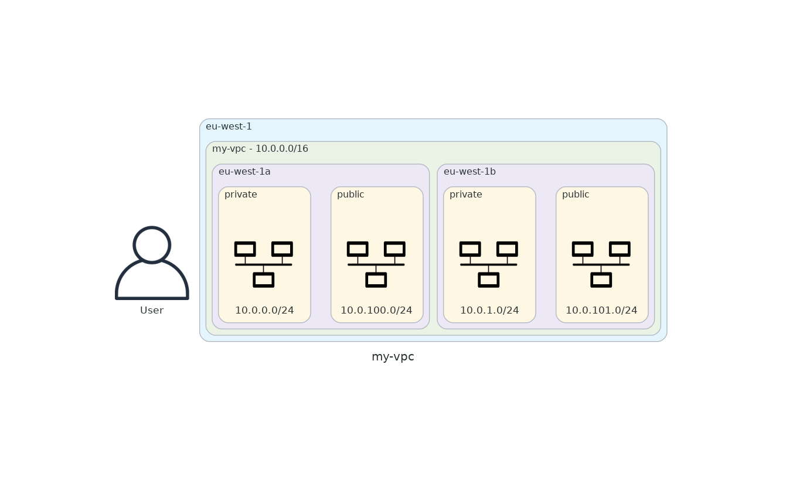

# **VPC parameters**
## **Diagram**

## **Global parameters**
* This VPC is named `my-vpc` and resides in the `eu-west-1` region.
* It uses the following CIDR block: `10.0.0.0/16`.
* It spans the `2` following Availability Zones (AZs):
  * `eu-west-1a`
  * `eu-west-1b`

## **Subnets**
* This VPC counts `2` public subnets and  `2` private subnets:

| Availability Zone | Public subnet ID | Public subnet IP range | Private subnet ID | Private subnet IP range | 
| --- | --- | --- | --- | --- |
| eu-west-1a | subnet-002ff6cd6d4450e3e | 10.0.100.0/24 | subnet-0d86928d92cc4e98a | 10.0.0.0/24 |
| eu-west-1b | subnet-09546550c796a4437 | 10.0.101.0/24 | subnet-02e7d4b822d2d6a1d | 10.0.1.0/24 |
